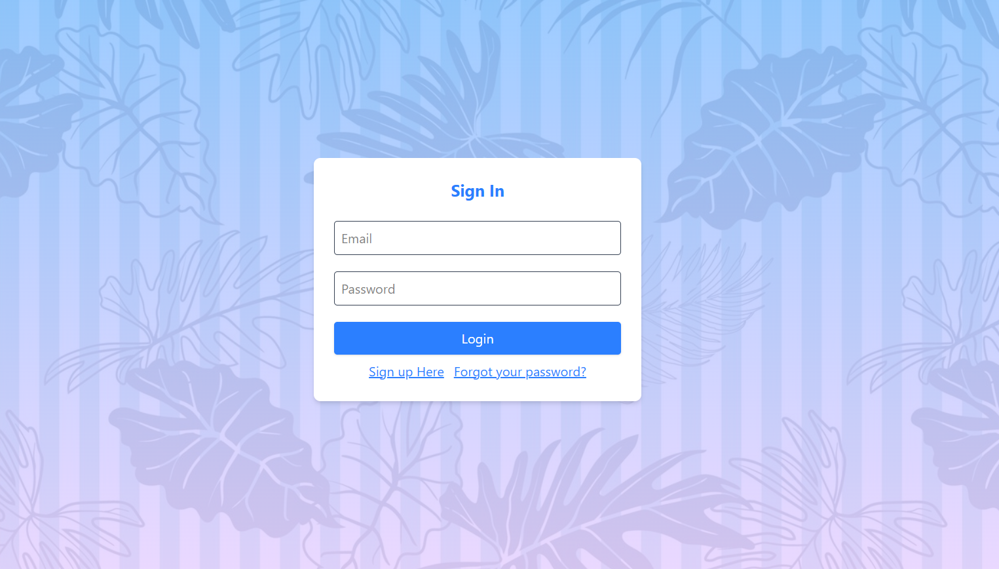
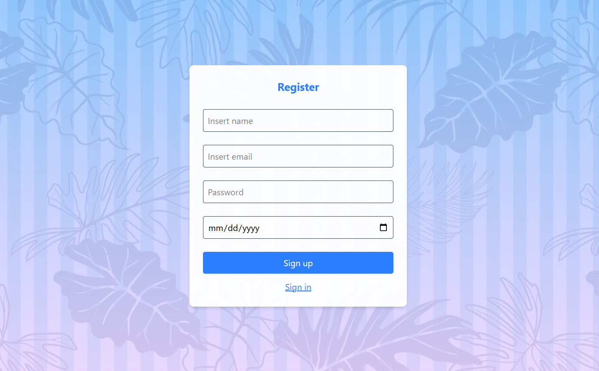
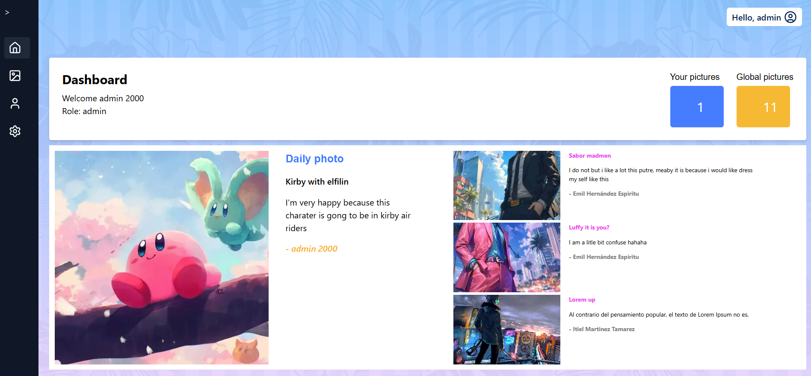
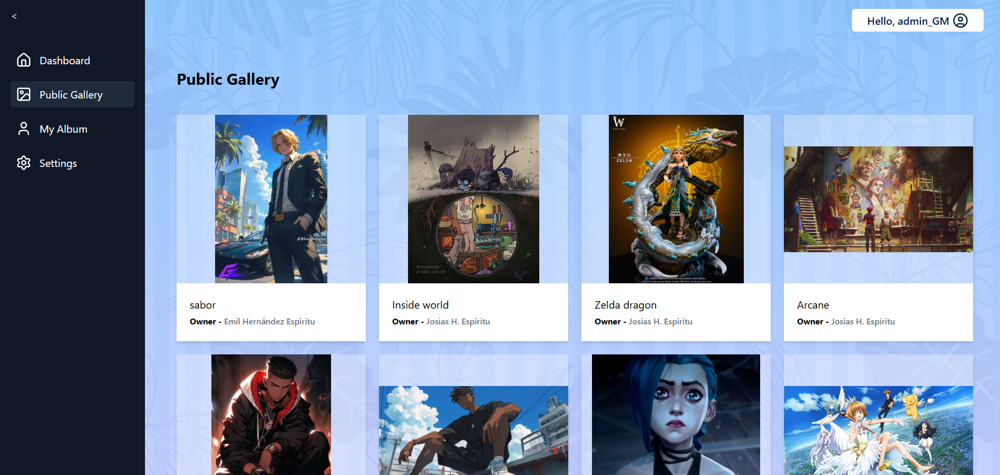
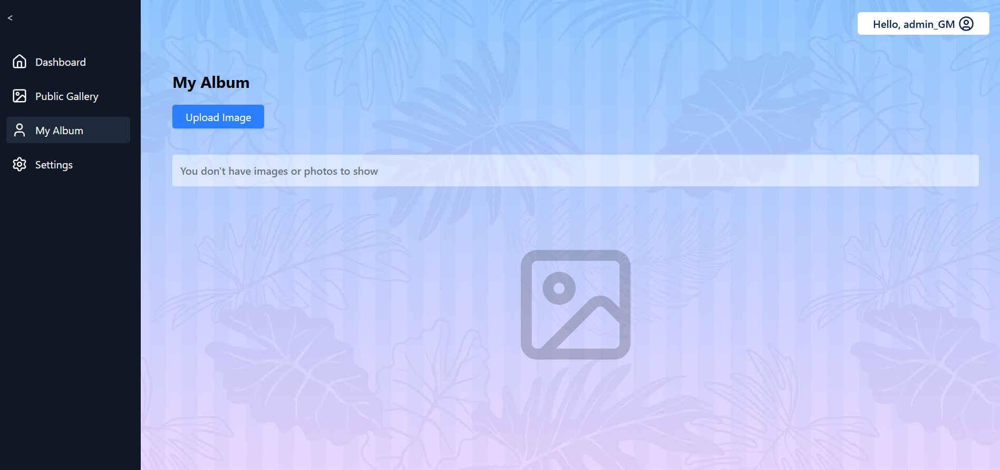
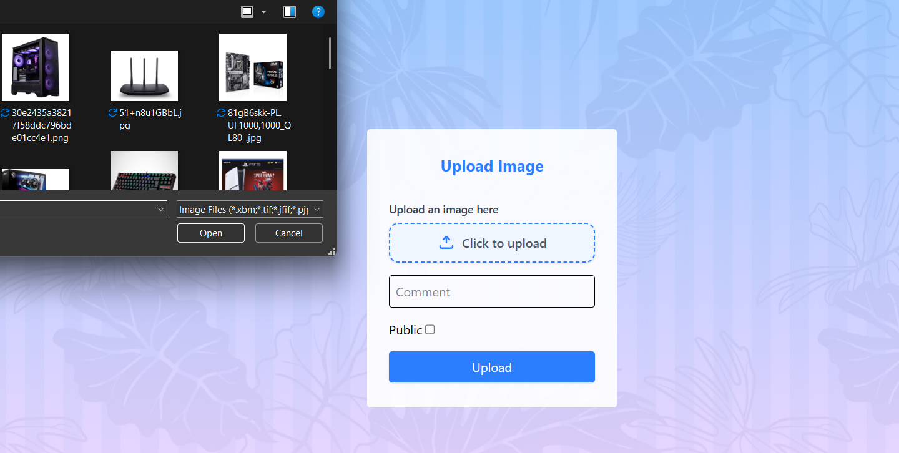
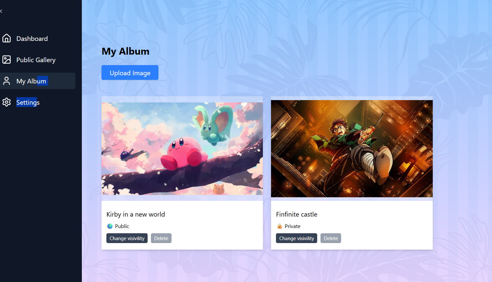
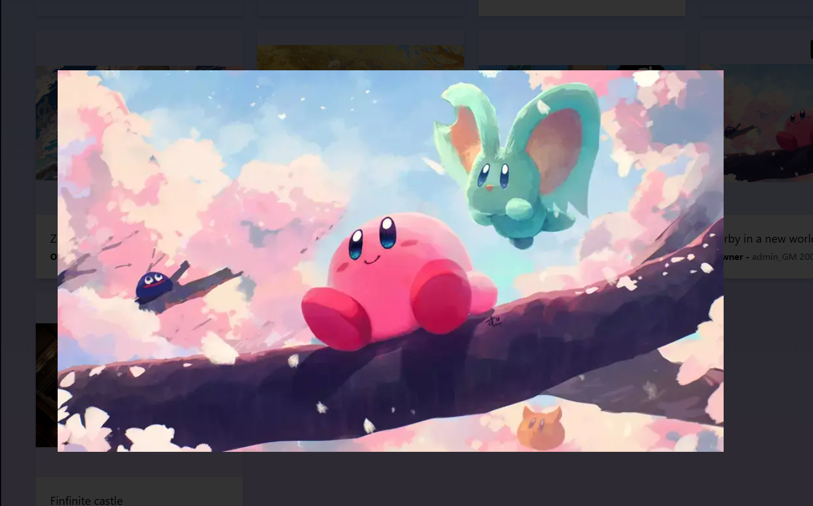
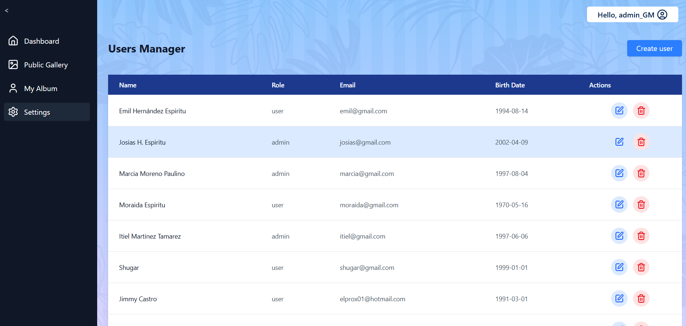
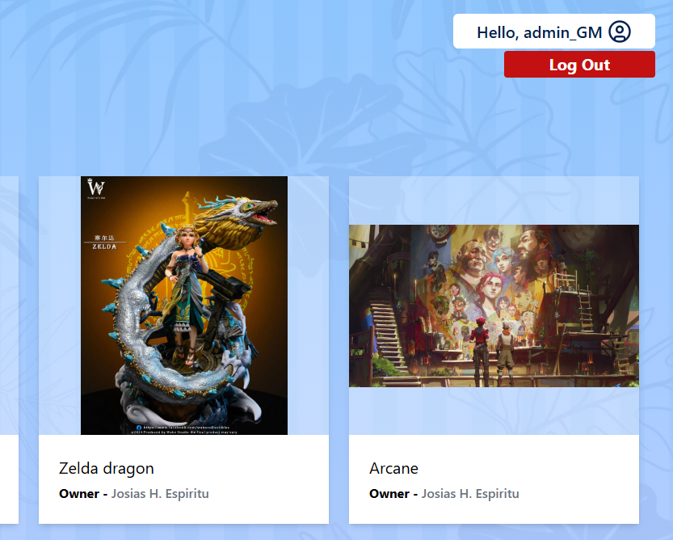

# My Album Fullstack App 

My Album Fullstack App is a dynamic, user-friendly platform built to allow users to upload their favorite photos and engage with the community by leaving comments. This project is a **full-stack** application, demonstrating a cohesive architecture from the database to the user interface.

* **Photo Upload:** Seamlessly upload and display images.
* **Commenting System:** Interact with photos by leaving comments.
* **Full-Stack Architecture:** Separate front-end, back-end, and database components.


## Tech Stack

This project leverages modern, robust technologies to deliver a fast and scalable experience:

| Component | Technology | Description |
| :--- | :--- | :--- |
| **Frontend** | **React** | A declarative, component-based library for building the user interface. |
| **Styling** | **Tailwind CSS** | A utility-first CSS framework for rapid and custom UI development. |
| **Backend** | **Node.js** | A JavaScript runtime environment for the server-side logic. |
| **Framework** | **Express** | A fast, unopinionated, minimalist web framework for Node.js. |
| **Database** | **MongoDB** | A NoSQL document database used for storing photo and comment data. |


### Login



### Sign Up



### Dashboard



### Public Gallery



### My album emty



### Upload Image



### My album 



### Image view



### Users Manager



### Log Out




### Here is the main charater here

```javascript
import React, { createContext, useContext, useState, useEffect } from "react";
import { jwtDecode } from "jwt-decode";
import api, { setAuthToken } from "../api/axios";

const AuthContext = createContext();

export const AuthProvider = ({ children }) => {
  const [token, setToken] = useState(localStorage.getItem("token") || null);
  const [user, setUser] = useState(() => (token ? jwtDecode(token) : null));
  const [loadingAuth, setLoadingAuth] = useState(true);

 //Start the token with provider
  useEffect(() => {
    const savedToken = localStorage.getItem("token");
    if (savedToken) {
      setToken(savedToken);
      setAuthToken(savedToken);
      setUser(jwtDecode(savedToken));
    }
    setLoadingAuth(false);
  }, []);

  useEffect(() => {
    if (token) {
      setAuthToken(token);
      setUser(jwtDecode(token));
      localStorage.setItem("token", token);
    } else {
      setAuthToken(null);
      setUser(null);
      localStorage.removeItem("token");
    }
  }, [token]);

  const login = async ({ email, password }) => {
    const res = await api.post("/auth/login", { email, password });
    const newToken = res.data.token || res.data.accessToken;
    if (!newToken) throw new Error("No token received");
    setToken(newToken);
  };

  const logout = () => setToken(null);

  return (
    <AuthContext.Provider value={{ user, token, login, logout, loadingAuth }}>
      {children}
    </AuthContext.Provider>
  );
};

export const useAuth = () => useContext(AuthContext);
```


### Front env.local

```env
VITE_API_URL=http://localhost:3000/api
```


### Backend env

```env
MONGO_URI=
JWT_SECRET=
FIRST_ADMIN_PASSWORD=
EMAIL_USER=
EMAIL_PASS=
```


### Cloudinary

```env
CLOUDINARY_CLOUD_NAME=
CLOUDINARY_API_KEY=
CLOUDINARY_API_SECRET=
```
